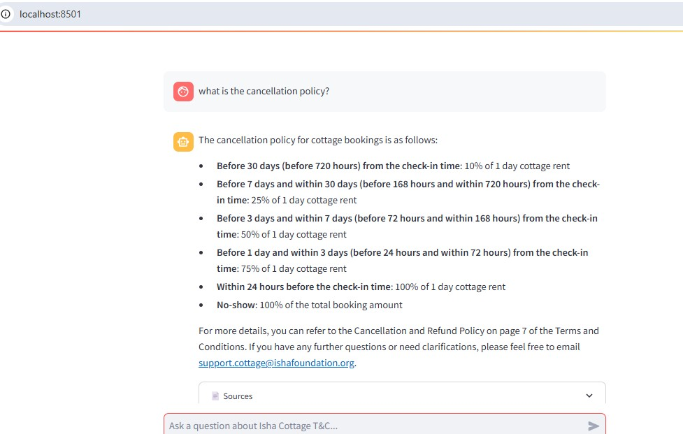
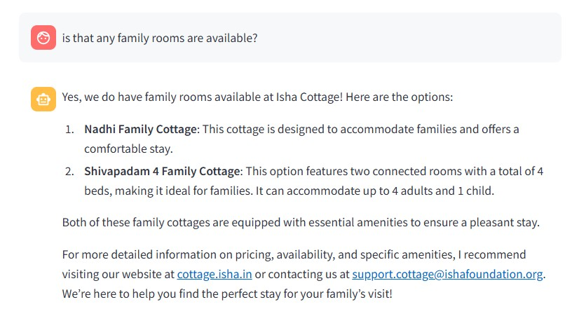
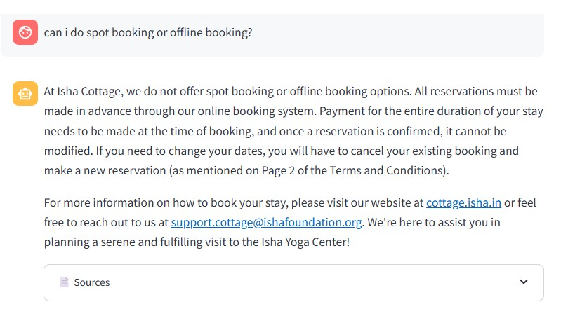
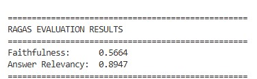

# 🏡 Isha Cottage RAG Agent

A production-grade Retrieval-Augmented Generation (RAG) agent that answers queries about **Isha Cottage** — a serene retreat stay at Isha Yoga Center, Coimbatore — using the official Terms & Conditions document and live website content.

Built as an AI Engineer portfolio project.

---

## 🎯 What it does

- Answers guest queries about booking, cancellation, rooms, facilities, and policies
- Retrieves information from the T&C PDF and official Isha websites
- Shows source citations with every answer
- Maintains conversation history across a session
- Evaluated with RAGAS benchmarking metrics

---

## 🏗️ Architecture

User Query

↓

Retrieve Node (FAISS MMR Search)

↓

Generate Answer Node (GPT-4o-mini)

↓

Answer + Sources

**Knowledge sources:**
- Isha Cottage Terms & Conditions PDF
- https://cottage.isha.in
- https://cottage.isha.in/terms-conditions/

---

## 🛠️ Tech Stack

| Layer | Technology |
|---|---|
| LLM | GPT-4o-mini (OpenAI) |
| Embeddings | text-embedding-3-small |
| Orchestration | LangGraph |
| Vector Store | FAISS |
| PDF Loading | PyMuPDF + LangChain |
| Web Scraping | BeautifulSoup4 |
| API | FastAPI |
| UI | Streamlit |
| Evaluation | RAGAS |
| Package Manager | uv |

---

## 📊 RAGAS Evaluation Results

Evaluated on 10 domain-specific questions:

| Metric | Score |
|---|---|
| Answer Relevancy | 0.9087 |
| Faithfulness | 0.5834 |

---

## 📁 Project Structure

isha-cottage-rag/

├── data/                    # T&C PDF

├── faiss_db/                # Persisted vector index

├── src/

│   ├── agent/               # LangGraph nodes and graph

│   ├── api/                 # FastAPI endpoints

│   ├── ingestion/           # PDF loader, chunker, web scraper

│   └── vectorstore/         # FAISS store and retriever

├── tests/                   # RAGAS evaluation

├── ui/                      # Streamlit chat interface

├── Dockerfile

├── docker-compose.yml

└── requirements.txt

---

## 🚀 Run Locally

**1. Clone the repository**
```bash
git clone https://github.com/haranskills/isha-cottage-rag.git
cd isha-cottage-rag
```

**2. Create virtual environment**
```bash
uv venv
.venv\Scripts\activate  # Windows
```

**3. Install dependencies**
```bash
uv pip install -r requirements.txt
```

**4. Set up environment variables**
```bash
cp .env.example .env
# Add your OPENAI_API_KEY in .env
```

**5. Run ingestion pipeline**
```bash
python -m src.ingestion.ingest
```

**6. Start FastAPI**
```bash
uvicorn src.api.main:app --reload --port 8000
```

**7. Start Streamlit UI**
```bash
streamlit run ui/app.py
```

Open `http://localhost:8501`

---

## 📡 API Endpoints

| Method | Endpoint | Description |
|---|---|---|
| GET | `/` | Health check |
| GET | `/health` | Service status |
| POST | `/chat` | Send a query |
| DELETE | `/session/{id}` | Clear session history |

**Example request:**
```json
POST /chat
{
  "query": "What is the cancellation policy?",
  "session_id": "user123"
}
```

---

## 🧪 Run Evaluation

```bash
python -m tests.eval_ragas
```

---

## 📸 Demo







### RAGAS Evaluation



## 👤 Author

**Hariharan**
AI Engineer | Journalist turned GenAI Developer
- 10 years experience in Journalism, PR & Content Creation
- Transitioning into AI/GenAI Engineering
- Certifications: Oracle GenAI Professional, AWS AI Practitioner, Google AI Essentials

---

## 📄 License

MIT License

